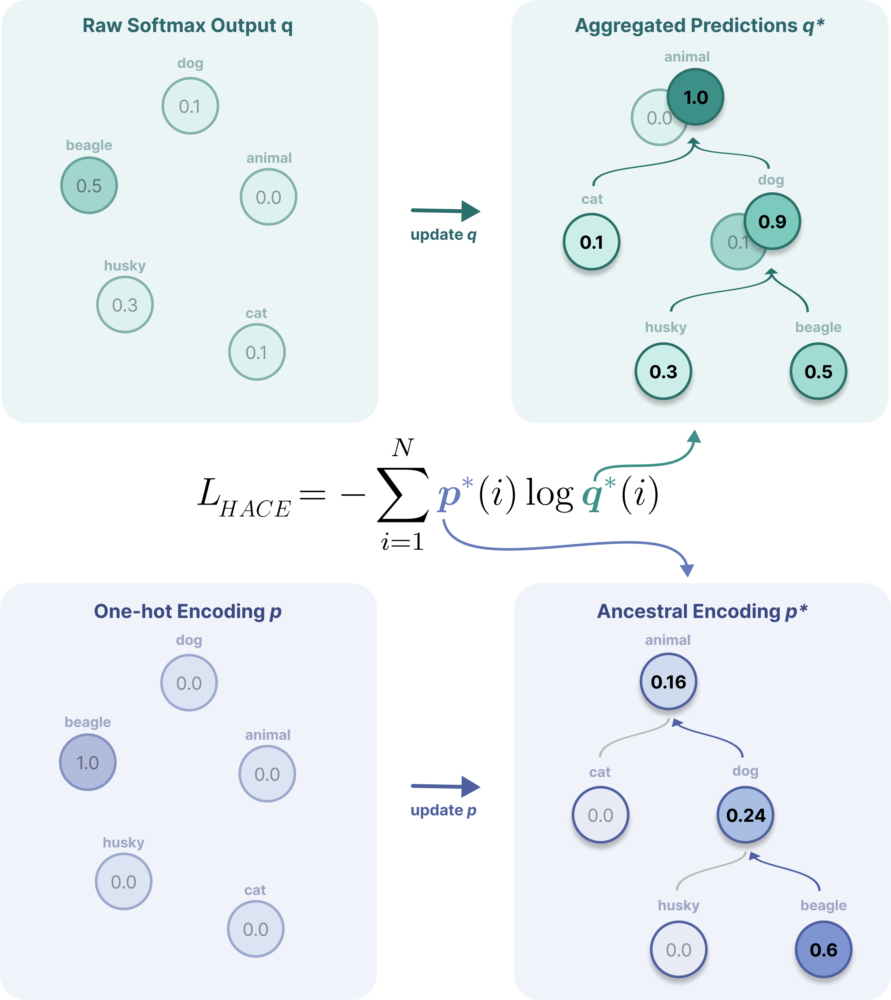

[](https://opensource.org/licenses/MIT)
[](https://arxiv.org/abs/2605.06274)

# HACE: Hierarchy-Aware Cross-Entropy

Official PyTorch implementation of **"When Labels Have Structure: Improving Image Classification with Hierarchy-Aware Cross-Entropy"**.

<p align="center">
  
</p>

---

## 🔑 Key Ideas

- **Prediction Aggregation** — probabilities are propagated up the class hierarchy, penalizing mistakes more heavily when predicted and true classes are semantically distant.
- **Ancestral Label Smoothing** — the ground-truth label mass is redistributed upward along the path from the true leaf class to the root, with each ancestor receiving geometrically decaying weight controlled by a dilution parameter *d*.
- **Drop-in replacement** — HACE replaces `nn.CrossEntropyLoss` with no changes to model architecture or inference pipeline.

---

## 📁 Repository Structure

```
hace/
├── hace/               # Core loss function implementation
│   ├── __init__.py
│   └── loss.py         # HierarchyAwareCrossEntropy
├── experiments/        # Training scripts and configs
├── data/               # Dataset preparation utilities
├── tests/              # Unit tests
├── requirements.txt
└── README.md
```

---

## 📄 Paper

If you use this work, please cite:

```bibtex
@article{chan2026hace,
  title         = {When Labels Have Structure: Improving Image Classification with Hierarchy-Aware Cross-Entropy},
  author        = {April Chan and Davide D'Ascenzo and Sebastiano Cultrera di Montesano},
  journal       = {arXiv preprint arXiv:2605.06274},
  year          = {2026},
  url           = {https://arxiv.org/abs/2605.06274}
}
```

---


